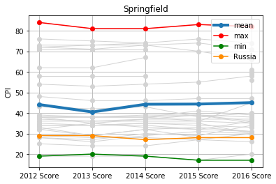
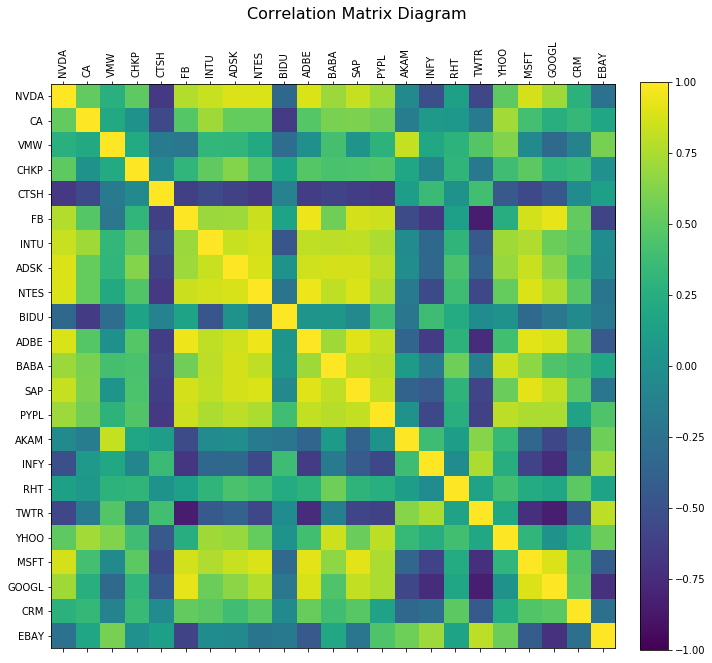
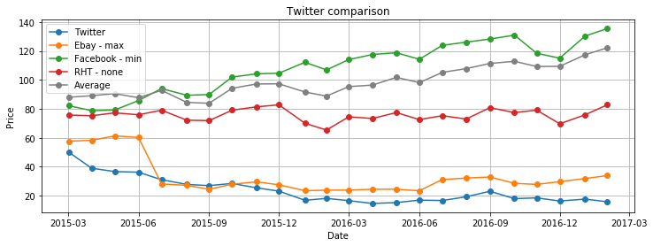

# ДОМАШНЕЕ ЗАДАНИЕ №2. Дескриптивный анализ данных

Гейне М.А. (geine@bmstu.ru)

## Цель работы

Приобрести опыт решения практических задач по анализу данных, таких как загрузка, трансформация, вычисление простых статистик и визуализация данных в виде графиков и диаграмм, посредством языка программирования Python.

## Вариант

Чтобы узнать свой вариант, введите Вашу фамилию в соответствующее поле ниже и запустите ячейку:

```python
surname = "Иванов"  # Ваша фамилия

alp = 'абвгдеёжзийклмнопрстуфхцчшщъыьэюя'
w = [1, 42, 21, 21, 34,  6, 44, 26, 18, 44, 38, 26, 14, 43,  4, 49, 45,
        7, 42, 29,  4,  9, 36, 34, 31, 29,  5, 30,  4, 19, 28, 25, 33]

d = dict(zip(alp, w))
variant =  sum([d[el] for el in surname.lower()]) % 40 + 1

print("Задача № 1 - вариант: ", variant % 5 + 1)
print("задача № 2 - вариант: ", variant % 4 + 1)
```

## Задание 1. Анализ индикаторов качества государственного управления (The Worldwide Government Indicators, WGI)

В качестве индикатора далее необходимо использовать контроль над коррупцией (Control of Corruption) и его показатели `rank` и `estimate`

- Набор данных:
    - [WGI](data/wgidataset.xlsx)
    - [Регионы](data/regions.xlsx)
- [Описание WGI](http://info.worldbank.org/governance/wgi/)

⚠️ **Замечание.** Исходный файл с данными редактировать нельзя.

1. Загрузите данные в DataFrame и сохраните в `DF_LOADED`
2. Отсортируйте данные по убыванию индекса DataFrame и сохраните в `DF_SORTED`
3. Отобразите данные по индексу WGI за 2022 год в виде горизонтального столбчатого графика (`rank`). Примерный вид графика приведен ниже


4. Сформируйте DataFrame из исходного для региона в соответствии с Вашим вариантом и сохраните в `DF_REGION`
    - Вариант 1. Asia Pacific
    - Вариант 2. Americas
    - Вариант 3. Europe and Central Asia
    - Вариант 4. Middle East and North Africa
    - Вариант 5. Sub Saharan Africa

5. Выведите данные DataFrame'a
6. Постройте графики индекса WGI за 1996-2022 для стран своего региона (`estimate`). Примерный вид графика приведен ниже

  

7. Найдите страны с наибольшим и наименьшим значением WGI Вашего варианта региона за 2022 год (`estimate`). Запишите эти страны в один DataFrame `DF_MINMAX` с соответствующими отметками

    ⚠️ **Замечание.** У нескольких стран может быть одна и та же позиция в рейтинге из-за одинаковых значений индекса

8. Определите средние значения региона за каждый год в период с 1996 по 2022 (`estimate`) и сохраните их в Series `S_MEANS` только из средних значений для каждого года

9. Постройте графики индекса WGI за 1996-2022 для стран своего региона и выделите страны с наибольшим и наименьшим значением WGI за 2022 год, а также отобразите среднее значение по региону и РФ. Примерный вид графика приведен ниже



10. Определите, как изменилось значение показателя `rank` с 1996 по 2022 (`rank`)

11. Выведите таблицу для ***Вашего варианта*** (WGI - `rank`) и сохраните в таблицу `RES_TABLE`

|             | Region | Country | Rank 1996 | Rank 2022 | Difference |
| ----------- | ------ | ------- | --------- | --------- | ---------- |
| mean_2022   | -      | -       | -         | -         | -          |
| max_2022    | -      | -       | -         | -         | -          |
| min_2022    | -      | -       | -         | -         | -          |
| Russia_2022 | -      | -       | -         | -         | -          |

12. Отобразите диаграмму размаха (`boxplot`) индекса WGI за 2022 для всех стран и для каждого региона в отдельности (на одном графике) (`estimate`)

## Задача 2. Анализ рынка акций

1. Загрузите данные в один dataframe из всех файлов в папке /data/stock. Все файлы имеют одинаковую структуру, в том числе наименование столбцов. В качестве значений индекса dataframe'а необходимо указать значения столбца "Date". Название столбцов должные соответствовать названию акций (имя файла без .csv), а их значения - значениям цены закрытия (столбец "Close" в файлах .csv). Сохраните DataFrame в `DF_COMPANIES`

    ⚠️ **Замечание.** Наборы данные были загружены с сайта https://finance.yahoo.com/

    ⚠️ **Замечание.** Нужна только цена закрытия

2. Рассчитайте корреляционную матрицу для всех акций и сохраните её в `DF_CORR`

3. Отобразите корреляционную матрицу в виде диаграммы. Примерный вид графика приведен ниже

  

4. В соответствии с Вашим вариантом определите:

    - акцию с максимальной положительной корреляцией (max)
    - акцию с максимальной отрицательной корреляцией (min)
    - акцию с минимальной корреляцией (которая больше всего соответствует отсутствию какой-либо корреляции (none))

    Варианты

    - **Вариант 1.** Apple (AAPL)
    - **Вариант 2.** Netflix (NFLX)
    - **Вариант 3.** Google (GOOGL)
    - **Вариант 4.** Uber (UBER)

  Сохраните результаты в списке `LST_COMP_CORR` в указанном порядке

5. Постройте диаграммы разброса (Ваша компания - Компания с min), (Ваша компания - Компания с max), (Ваша компания - Компания с none)

6. Рассчитайте среднюю цену акций для каждого месяца (исходные данные взяты с интервалом в месяц) и сохраните результат в `S_MEANS_COMP`

7. Постройте графики для акций из пункта 4 и средней из пункта 6. Примерный вид графика приведен ниже

  
